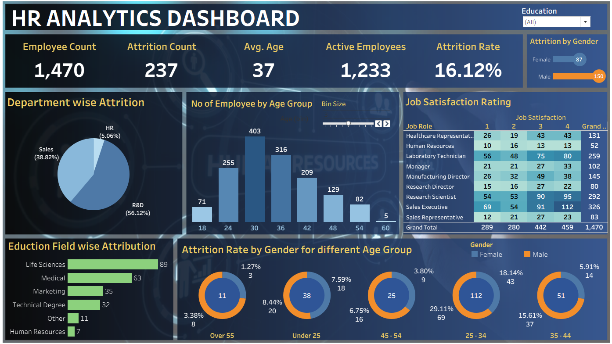

## 📊 HR Analytics Dashboard

This Tableau dashboard provides a comprehensive analysis of employee attrition in an organization. It enables HR professionals and decision-makers to identify key factors contributing to attrition, examine employee demographics, and make data-driven workforce strategies.

### 📌 Key Insights

* **Total Employees**: 1,470
* **Active Employees**: 1,233
* **Attrition Count**: 237
* **Attrition Rate**: 16.12%
* **Average Age**: 37 years

### 🧩 Dashboard Components

#### 🔹 Department-wise Attrition

A pie chart breakdown showing attrition contribution by department:

* R\&D: 56.12%
* Sales: 38.82%
* HR: 5.06%

#### 🔹 Employee Age Distribution

Bar chart displaying number of employees in different age bins (e.g., 18–24, 25–30...).

#### 🔹 Attrition by Gender

Visual representation of male vs. female attrition:

* Male: 150
* Female: 87

#### 🔹 Job Satisfaction Rating

Heatmap showing satisfaction scores (1–4) across job roles like Sales Executive, Research Scientist, Manager, etc.

#### 🔹 Education Field-wise Attrition

Horizontal bar chart showing attrition counts across education backgrounds:

* Life Sciences: 89
* Medical: 63
* Others...

#### 🔹 Attrition by Gender & Age Group

Doughnut charts visualizing attrition distribution across age groups and genders, helping to identify vulnerable segments (e.g., 25–34 age group shows 29.11% attrition rate).

### 🛠️ Tools Used

* **Tableau Public** for data visualization
* **Microsoft Excel / CSV** as data source
* **GitHub** for project documentation and sharing

### 💡 Conclusion

This dashboard provides actionable insights to reduce attrition by focusing on high-risk age groups, departments, and education fields. It supports strategic planning and helps identify improvement areas in employee engagement and satisfaction.

Let me know if you want to include:

* The dataset source
* Live Tableau Public link
* PDF or report version
* More technical implementation details (e.g., calculated fields, filters used)
